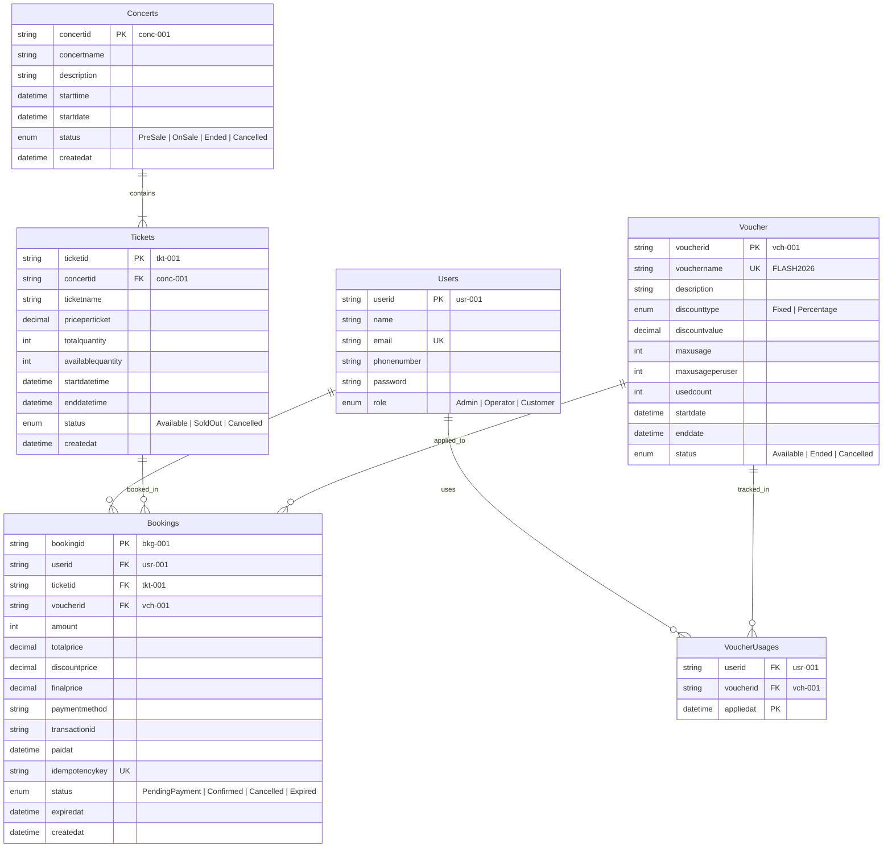

# 🗄️ Database Design & Technical Analytics Documentation (GEEK UP Platform)

Tài liệu Phân tích Kỹ thuật Chi tiết về Thiết kế Cơ sở Dữ liệu (Database Design Documentation) cho Hệ thống Đặt Vé Ca Nhạc Flash Sale chịu tải cao.

---

## 📋 1. Tổng Quan Triết Lý Thiết Kế (Database Philosophy & Architecture)

Thiết kế Cơ sở Dữ liệu dựa trên 4 trụ cột kiến trúc cốt lõi:

1. **Chuẩn Hóa Dữ Liệu 3NF (Third Normal Form)**:
   - Loại bỏ hoàn toàn sự dư thừa dữ liệu (Data Redundancy) và các phụ thuộc bắc cầu (Transitive Dependencies).
   - Đảm bảo tính Toàn vẹn Dữ liệu (Data Integrity) khi cập nhật thông tin sự kiện hoặc hạng vé.

2. **Chống Bán Vượt Vé Nguyên Tử (Atomic Inventory Concurrency)**:
   - Sử dụng cơ chế Row-level Lock tự nhiên của PostgreSQL thông qua câu lệnh SQL Atomic `UPDATE ... WHERE availablequantity >= N`.
   - Loại bỏ triệt để hiện tượng Race Condition khi hàng nghìn người dùng bấm mua vé cùng một miligiây.

3. **Bảo Vệ Tính Vô Hiệu (Idempotency & Replay Protection)**:
   - Kết hợp chỉ mục `UNIQUE (idempotencykey)` trên PostgreSQL với Redis Cloud (TTL 24h) để chặn tuyệt đối việc tạo trùng đơn hàng khi bị double-click hoặc lỗi mạng client retries.

4. **Tối Ưu Hóa Tốc Độ Truy Vấn (High-Performance B-Tree Indexing)**:
   - Thiết kế các B-Tree Composite Indexes chuyên biệt phục vụ các luồng đọc/ghi tải cao, chuyển các phép tìm kiếm từ `Sequential Scan` sang `Index Range Scan` độ phức tạp $O(\log N)$.

---

## 🗂️ 2. Sơ Đồ Liên Kết Thực Thể (Entity-Relationship Diagram - ERD)



---

## 🔍 3. Phân Tích & Giải Trình Quyết Định Thiết Kế (Design Analytics & Rationale)

### 3.1. Quyết Định 1: Đạt Chuẩn Normalization 3NF (Loại bỏ `concertid` khỏi `Bookings`)

- **Vấn đề đặt ra**: Ban đầu, bảng `Bookings` chứa cả `ticketid` và `concertid`. Tuy nhiên, về mặt phụ thuộc dữ liệu:
  - `Booking ➔ Ticket` (Mỗi đơn đặt vé ứng với 1 hạng vé cụ thể).
  - `Ticket ➔ Concert` (Mỗi hạng vé thuộc về 1 concert duy nhất).
- **Phân tích Rủi ro**: Việc lưu cả `concertid` ở `Bookings` tạo ra phụ thuộc bắc cầu (`Booking ➔ Ticket ➔ Concert`). Nếu chẳng may một hạng vé được đổi sang Concert khác hoặc dữ liệu chênh lệch, sẽ xảy ra **Anomalies (Bất thường dữ liệu)** giữa `Bookings.concertid` và `Tickets.concertid`.
- **Giải pháp Lựa chọn**: Loại bỏ cột `concertid` ở bảng `Bookings`. Khi cần thông tin Concert của một đơn hàng, hệ thống truy vấn qua mối quan hệ chuẩn `Bookings ➔ Tickets ➔ Concerts`. Điều này đảm bảo tính nhất quán dữ liệu 100% và tuân thủ tuyệt đối quy tắc 3NF.

---

### 3.2. Quyết Định 2: Giải Pháp Chống Overselling Nguyên Tử (Atomic SQL Execution)

- **Vấn đề đặt ra**: Trong đợt Flash Sale, 1,000 requests đồng thời gửi đến để tranh mua 10 vé còn lại.
- **Cách làm thông thường (Bị Race Condition)**:
  ```typescript
  // ❌ Check-then-Act ở tầng ứng dụng (Rất nguy hiểm)
  const ticket = await findTicket(ticketid);
  if (ticket.availablequantity >= amount) {
    await updateTicket(ticket.availablequantity - amount); // Bán vượt vé!
  }
  ```
- **Giải pháp Lựa chọn (Atomic SQL at Database Engine Level)**:
  ```sql
  UPDATE "Tickets"
  SET "availablequantity" = "availablequantity" - $1
  WHERE "ticketid" = $2 AND "availablequantity" >= $1;
  ```
- **Phân tích Kỹ thuật**:
  - PostgreSQL thực thi cơ chế **Row-level Write Lock** tự nhiên đối với bản ghi Ticket đang bị sửa.
  - Phép kiểm tra `availablequantity >= $1` diễn ra trong cùng một giao dịch Atomic.
  - Nếu số lượng không đủ, PostgreSQL trả về kết quả `0 rows updated`. Ứng dụng nhận biết và thông báo hết vé ngay lập tức mà không cần dùng đến Distributed Lock phức tạp ở application layer.

---

### 3.3. Quyết Định 3: Chiến Lược Quản Lý Hạn Ngạch Voucher Dùng Tầng Kết Hợp

- **Vấn đề đặt ra**: Mã giảm giá có 2 hạn ngạch:
  1. `maxusage`: Tổng số lượt sử dụng tối đa của toàn chiến dịch.
  2. `maxusageperuser`: Số lượt tối đa mỗi người dùng được phép dùng.
- **Giải pháp Lựa chọn**:
  - Dùng cột `usedcount` ở bảng `Voucher` tăng nguyên tử (`UPDATE "Voucher" SET usedcount = usedcount + 1 WHERE usedcount < maxusage`) để kiểm tra hạn ngạch tổng.
  - Tạo bảng trung gian `VoucherUsages` ghi nhận lịch sử `(userid, voucherid, appliedat)`.
- **Phân tích Kỹ thuật**: 
  - Khóa chính tổng hợp `PRIMARY KEY (userid, voucherid, appliedat)` giúp truy vấn đếm số lượt đã dùng của 1 User (`SELECT COUNT(*) FROM "VoucherUsages" WHERE userid = $1 AND voucherid = $2`) đạt tốc độ cực nhanh thông qua Index Scan.

---

## ⚡ 4. Phân Tích Chiến Lược Đánh Chỉ Mục (Indexing Strategy Analytics)

Bảng dưới đây phân tích các luồng truy vấn chính và tác động của chỉ mục B-Tree đến kế hoạch thực thi SQL Query Execution Plan:

| Bảng | Tên Index | Các Cột Đánh Index | Kịch Bản Truy Vấn Sử Dụng (Use Cases) | Tác Động Thực Thi (Execution Plan Impact) |
| :--- | :--- | :--- | :--- | :--- |
| **Bookings** | `idx_bookings_user_created` | `(userid, createdat DESC)` | Customer xem lịch sử đơn hàng của tôi (`GET /bookings/my-bookings`). | Chuyển từ `Seq Scan` toàn bảng ➔ `Index Scan` theo User ID. |
| **Bookings** | `idx_bookings_status_created` | `(status, createdat DESC)` | Admin lọc đơn hàng theo trạng thái (`GET /admin/bookings?status=Confirmed`). | Tăng tốc tìm kiếm & loại bỏ thao tác In-Memory Sort. |
| **Bookings** | `idx_bookings_ticketid` | `(ticketid)` | JOIN dữ liệu từ bảng `Tickets` sang `Bookings`. | Giúp phép JOIN thực thi dạng `Index Scan` nhanh gấp hàng trăm lần. |
| **Bookings** | `idx_bookings_status_expired` | `(status, expiredat)` | Background Worker quét hoàn trả vé các đơn `PendingPayment` hết hạn 10p. | Giới hạn phạm vi quét chỉ ở các đơn chưa thanh toán. |
| **Tickets** | `idx_tickets_concert_status` | `(concertid, status)` | Khách hàng xem danh sách vé của 1 Concert (`GET /browse/:concertId`). | Trả về các hạng vé `Available` ngay lập tức. |
| **Tickets** | `idx_tickets_sale_dates` | `(status, startdatetime, enddatetime)` | Kiểm tra hạng vé có đang mở bán theo khung giờ hay không. | Lọc nhanh các hạng vé trong khoảng thời gian sale. |
| **Concerts** | `idx_concerts_status_startdate` | `(status, startdate ASC)` | Khách hàng duyệt danh sách Concerts (`GET /browse`). | Trả về danh sách sự kiện `OnSale` đã được sắp xếp ngày. |
| **Voucher** | `idx_vouchers_status_dates` | `(status, startdate, enddate)` | Khách hàng áp mã giảm giá trong checkout. | Kiểm tra nhanh điều kiện hiệu lực của Voucher. |

---

## 🔒 5. Ràng Buộc Khóa Ngoại & Hành Vi CASCADE (Data Integrity & Foreign Keys)

- **`Tickets` ➔ `Concerts` (`ON DELETE CASCADE`)**:
  - Khi Admin xóa một Concert, toàn bộ các Hạng vé thuộc Concert đó sẽ tự động bị xóa sạch để tránh rác dữ liệu.
- **`Bookings` ➔ `Users` / `Tickets` / `Voucher` (`ON DELETE NO ACTION`)**:
  - Ngăn chặn việc xóa User hoặc Ticket nếu đã từng có Đơn hàng phát sinh liên quan (Bảo vệ dữ liệu kế toán tài chính).
