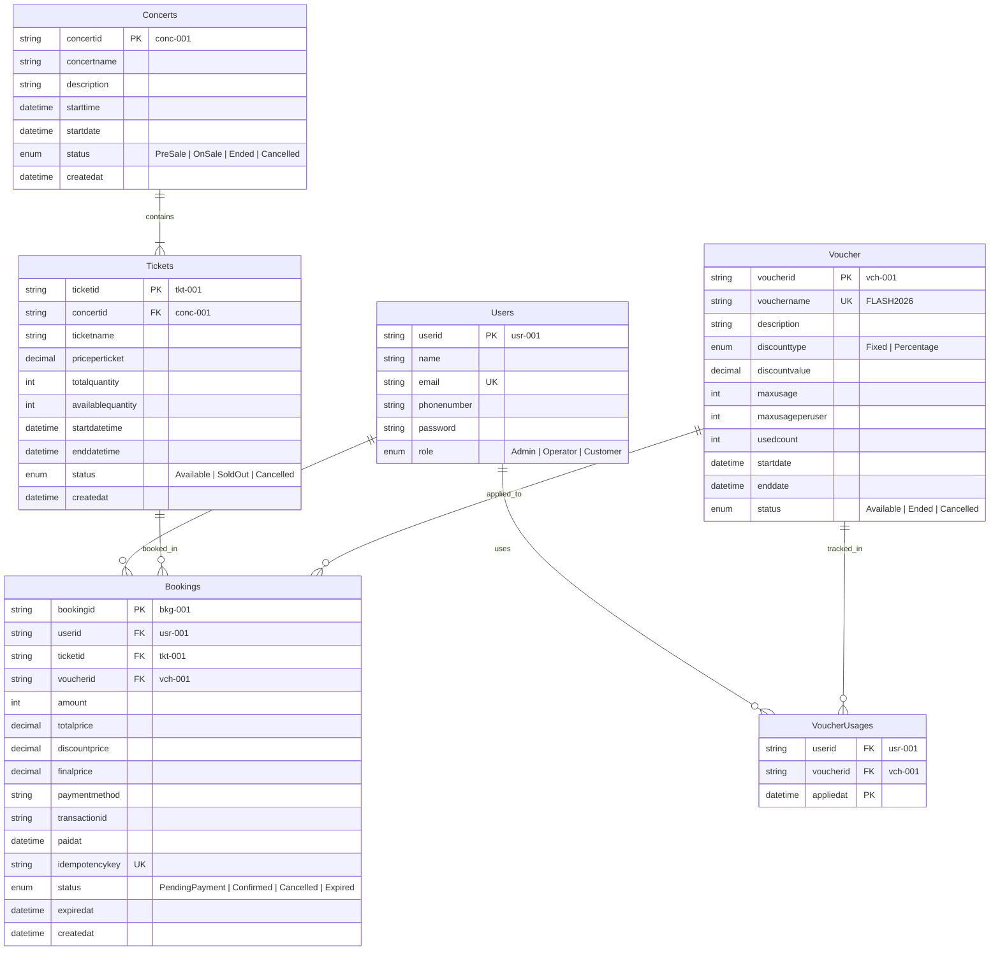

# 🗄️ Database Architecture & Design Report (GEEK UP Platform)

Báo cáo Thiết kế Kiến trúc Cơ sở Dữ liệu (Database Design Report) phân tích mô hình dữ liệu, chuẩn hóa quan hệ, giải pháp xử lý đồng thời (Concurrency Control) và chiến lược tối ưu hóa hiệu năng truy vấn cho Hệ thống Đặt Vé Ca Nhạc chịu tải cao.

---

## 📋 1. Triết Lý Thiết Kế Cấu Trúc (Core Design Principles)

Cơ sở dữ liệu của hệ thống được xây dựng trên 4 nguyên tắc kiến trúc trọng tâm:

1. **Chuẩn Hóa Dữ Liệu Tối Đa (Strict 3NF Normalization)**:
   - Tất cả các thực thể được thiết kế tuân thủ chuẩn 3NF (Third Normal Form), đảm bảo mỗi thuộc tính phi khóa phụ thuộc duy nhất vào khóa chính của bảng đó.
   - Loại bỏ hoàn toàn sự dư thừa dữ liệu (Data Redundancy) và hiện tượng bất thường khi cập nhật dữ liệu (Update Anomalies).

2. **Kiểm Soát Đồng Thời Nguyên Tử Tại Tầng Cơ Sở Dữ Liệu (Atomic Concurrency Control)**:
   - Sử dụng cơ chế Row-level Lock tự nhiên của hệ quản trị cơ sở dữ liệu PostgreSQL kết hợp với các thao tác cập nhật nguyên tử (Atomic Operations).
   - Đảm bảo tính nhất quán dữ liệu kho vé (No Overselling) dưới áp lực hàng nghìn truy vấn đồng thời trong kịch bản Flash Sale.

3. **Đảm Bảo Tính Độc Đáo Về Giao Dịch (Transactional Idempotency)**:
   - Đảm bảo tính bất biến của các giao dịch tạo đơn hàng thông qua ràng buộc duy nhất (Unique Constraint) cấp CSDL kết hợp phân tầng bộ nhớ đệm (Caching Layer).

4. **Tối Ưu Hóa Đường Truy Vấn Bằng Chỉ Mục B-Tree (Query Performance Optimization)**:
   - Xây dựng hệ thống chỉ mục phức hợp (Composite Indexes) phục vụ các luồng truy vấn có tần suất cao, tối ưu hóa chi phí thực thi lệnh từ `Sequential Scan` sang `Index Range Scan` với độ phức tạp $O(\log N)$.

---

## 🗂️ 2. Sơ Đồ Thực Thể Liên Kết (Entity-Relationship Diagram - ERD)

---

## 🔍 3. Phân Tích Kiến Trúc & Giải Pháp Kỹ Thuật (Architectural Analysis & Technical Solutions)

### 3.1. Phân Tích Mô Hình Quan Hệ Chuẩn 3NF (3NF Normalization Analysis)

Hệ thống thiết kế mô hình quan hệ phân cấp rõ ràng nhằm triệt tiêu sự phụ thuộc bắc cầu:

- **Luồng quan hệ**: `Users` ➔ `Bookings` ➔ `Tickets` ➔ `Concerts`.
- **Nguyên lý thiết kế**: Thực thể `Bookings` chỉ liên kết trực tiếp tới `ticketid` của thực thể `Tickets`. Do mỗi hạng vé (`Tickets`) luôn gắn liền với một sự kiện (`Concerts`) cụ thể qua `concertid`, việc truy xuất thông tin sự kiện của một đơn hàng sẽ được thực thi thông qua quan hệ nối (JOIN) giữa các bảng.
- **Hiệu quả kiến trúc**: 
  - Đảm bảo tính nhất quán tuyệt đối của dữ liệu (Single Source of Truth).
  - Triệt tiêu hoàn toàn rủi ro bất đồng bộ thông tin giữa sự kiện và hạng vé.
  - Tối ưu hóa dung lượng lưu trữ trên đĩa cứng và bộ nhớ đệm.

---

### 3.2. Cơ Chế Xử Lý Đồng Thời Nguyên Tử (Atomic Inventory Concurrency Control)

Đối với bài toán bán vé Flash Sale với lưu lượng truy vấn cao, việc kiểm soát tranh chấp tài nguyên (Resource Contention) được giải quyết tại tầng Database Engine:

- **Nguyên lý thực thi**:
  Thao tác trừ số lượng vé khả dụng (`availablequantity`) được đóng gói trong một câu lệnh cập nhật nguyên tử duy nhất (Atomic Update Expression) kèm điều kiện kiểm tra hạn ngạch:
  - Phép kiểm tra điều kiện `availablequantity >= N` và phép trừ `availablequantity = availablequantity - N` diễn ra đồng thời trong cùng một chu kỳ ghi của Database.
  - Cơ chế **Row-level Lock** của PostgreSQL tự động phong tỏa dòng dữ liệu của hạng vé tương ứng trong thời gian xử lý cực ngắn ($< 1\text{ms}$), buộc các tiến trình concurrent khác phải chờ hoặc nhận kết quả thất bại ngay lập tức.
- **Ưu điểm**:
  - Không gây tình trạng bán vượt kho (No Overselling / No Race Condition).
  - Giảm thiểu chi phí quản lý Distributed Lock phức tạp ở tầng ứng dụng, giúp hệ thống đạt throughput tối đa.

---

### 3.3. Cơ Chế Bảo Vệ Giao Dịch Vô Hiệu (Transactional Idempotency Pattern)

Để bảo vệ hệ thống trước các sự cố bấm trùng nút đặt vé (Double-clicking) hoặc lỗi truy vấn lặp lại từ phía Client:

- **Thiết kế cấp CSDL**: Trường `idempotencykey` trên bảng `Bookings` được thiết lập chỉ mục `UNIQUE`.
- **Cơ chế hoạt động**: Bất kỳ nỗ lực tạo đơn hàng mới với cùng một chuỗi `idempotencykey` sẽ lập tức bị chặn lại bởi ràng buộc duy nhất của PostgreSQL, đảm bảo một yêu cầu chỉ sinh ra duy nhất một bản ghi thanh toán.

---

### 3.4. Kiến Trúc Phân Tầng Quản Lý Mã Giảm Giá (Voucher Usage Tracking Architecture)

Hệ thống tách biệt việc quản lý hạn ngạch Voucher thành hai cấp độ độc lập:

1. **Hạn ngạch Chiến dịch Tổng (`maxusage`)**: 
   - Quản lý thông qua thuộc tính `usedcount` trên thực thể `Voucher`, cập nhật nguyên tử mỗi khi có đơn hàng áp dụng thành công.
2. **Hạn ngạch Cá nhân (`maxusageperuser`)**:
   - Quản lý thông qua bảng quan hệ nhật ký `VoucherUsages` ghi nhận lịch sử `(userid, voucherid, appliedat)`.
   - Phép kiểm tra lượt dùng của người dùng được thực thi qua câu lệnh đếm có chỉ mục, đảm bảo tốc độ phản hồi tính bằng miligiây.

---

## ⚡ 4. Chiến Lược Đánh Chỉ Mục & Tối Ưu Truy Vấn (Indexing Strategy Analytics)

Hệ thống thiết kế các B-Tree Composite Index được tinh chỉnh chuyên biệt cho từng đường truy vấn chính (Hot Query Paths):

| Bảng | Tên Index | Cấu Trúc Cột Đánh Index | Kịch Bản Truy Vấn Sử Dụng (Use Cases) | Tác Động Lên Execution Plan |
| :--- | :--- | :--- | :--- | :--- |
| **Bookings** | `idx_bookings_user_created` | `(userid, createdat DESC)` | Truy vấn danh sách đơn hàng của người dùng sắp xếp theo thời gian mới nhất. | Chuyển `Seq Scan` toàn bảng ➔ `Index Scan` theo User ID. |
| **Bookings** | `idx_bookings_status_created` | `(status, createdat DESC)` | Màn hình Quản trị viên giám sát và lọc đơn hàng theo trạng thái. | Tối ưu phép lọc và triệt tiêu chi phí In-Memory Sorting. |
| **Bookings** | `idx_bookings_ticketid` | `(ticketid)` | Thực thi các phép nối dữ liệu (JOIN) giữa bảng `Tickets` và `Bookings`. | Tăng tốc độ truy vấn liên bảng trong báo cáo thống kê. |
| **Bookings** | `idx_bookings_status_expired` | `(status, expiredat)` | Tiến trình tự động quét và thu hồi vé từ các đơn hàng chờ thanh toán hết hạn. | Tối ưu hóa truy vấn lọc các đơn hàng đến hạn xử lý. |
| **Tickets** | `idx_tickets_concert_status` | `(concertid, status)` | Người dùng tra cứu danh sách các hạng vé đang mở bán của một sự kiện. | Giảm chi phí quét dữ liệu xuống độ phức tạp $O(\log N)$. |
| **Tickets** | `idx_tickets_sale_dates` | `(status, startdatetime, enddatetime)` | Kiểm tra điều kiện hiệu lực khung giờ mở bán của hạng vé. | Xác thực trạng thái mở bán thời gian thực. |
| **Concerts** | `idx_concerts_status_startdate` | `(status, startdate ASC)` | Người dùng duyệt danh sách các sự kiện âm nhạc đang diễn ra. | Trả về kết quả sắp xếp theo thời gian khởi chạy. |
| **Voucher** | `idx_vouchers_status_dates` | `(status, startdate, enddate)` | Xử lý kiểm tra điều kiện áp dụng mã giảm giá khi đặt vé. | Tăng tốc độ kiểm tra hiệu lực thời gian của Voucher. |

---

## 🔒 5. Quy Định Ràng Buộc Khóa Ngoại & Integrity Controls (Foreign Key Constraints)

- **`Tickets` ➔ `Concerts` (`ON DELETE CASCADE`)**:
  - Đảm bảo tính toàn vẹn hệ thống: Khi một sự kiện bị hủy bỏ hoàn toàn khỏi hệ thống, các hạng vé thuộc sự kiện đó sẽ tự động được thu hồi đồng bộ.
- **`Bookings` ➔ `Users` / `Tickets` / `Voucher` (`ON DELETE NO ACTION`)**:
  - Bảo vệ dữ liệu lịch sử giao dịch: Hệ thống chặn hoàn toàn các thao tác xóa người dùng hoặc hạng vé đã phát sinh đơn hàng, đảm bảo tính toàn vẹn dữ liệu kế toán và đối soát tài chính.
