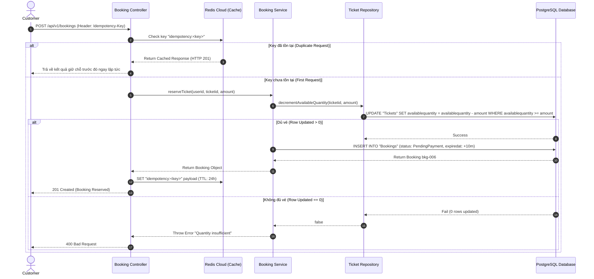

# 🏛️ System Architecture & Engineering Design Document (GEEK UP Platform)

Tài liệu Thiết kế Kiến trúc Hệ thống, Luồng xử lý Sequence Diagram, Chiến lược Bảo mật và Phân tích Kỹ thuật chuyên sâu cho Hệ thống Đặt Vé Ca Nhạc Flash Sale chịu tải cao.

_(Lưu ý: Phân tích kỹ thuật chuyên sâu về Cơ sở dữ liệu & ERD được trình bày tại [DATABASE_DESIGN.md](./DATABASE_DESIGN.md))_

---

## 1. 🏗️ Mô Hình Kiến Trúc 3 Lớp (3-Layer Architecture)

Dự án tuân thủ nghiêm ngặt mô hình phân tầng **3-Layer Architecture** để tách biệt trách nhiệm (Separation of Concerns), giúp hệ thống đạt tính mô-đun hóa cao, dễ mở rộng và duy trì:

```
                  ┌───────────────────────────────┐
                  │    HTTP Client / Postman      │
                  └──────────────┬────────────────┘
                                 │ HTTP Requests (JSON)
                                 ▼
   ┌─────────────────────────────────────────────────────────────┐
   │ 1. CONTROLLERS LAYER (src/controllers/)                     │
   │    - Tiếp nhận Express req / res.                           │
   │    - Thực hiện JWT Authentication & Role Authorization.     │
   │    - Chuyển tiếp Dữ liệu sang Services Layer.               │
   └─────────────────────────────┬───────────────────────────────┘
                                 │ Method Calls
                                 ▼
   ┌─────────────────────────────────────────────────────────────┐
   │ 2. SERVICES LAYER (src/services/)                           │
   │    - Chứa toàn bộ Business Logic & Domain Rules.            │
   │    - Ràng buộc Thời gian, Mức giảm giá, Hạn ngạch Voucher.  │
   │    - Tính toán Tổng tiền, Thành tiền finalprice.            │
   └─────────────────────────────┬───────────────────────────────┘
                                 │ Data Access Operations
                                 ▼
   ┌─────────────────────────────────────────────────────────────┐
   │ 3. REPOSITORIES LAYER (src/repositories/)                   │
   │    - Giao tiếp trực tiếp với PostgreSQL qua Prisma ORM.     │
   │    - Đảm bảo tính Toàn vẹn Giao dịch (Database Transaction).│
   │    - Thực thi Atomic SQL UPDATE để chống Overselling.       │
   └─────────────────────────────┬───────────────────────────────┘
                                 │ SQL Queries
                                 ▼
                    ┌──────────────────────────┐
                    │ PostgreSQL Database      │
                    └──────────────────────────┘
```

---

## 2. 🔄 Luồng Đặt Vé Giữ Chỗ (Sequence Diagram - Flash Sale Booking Flow)

Sơ đồ trình bày luồng giữ chỗ vé, áp dụng Idempotency Redis Cloud và Atomic SQL Lock trong môi trường tải cao:



---

## 3. ⚡ Giải Pháp Kỹ Thuật Giải Quyết Bài Toán Tải Cao (High Concurrency Solutions)

### A. Chống Overselling (Bán vượt vé)

- **Thách thức**: Trong đợt Flash Sale, hàng nghìn requests đồng thời tranh mua số lượng vé giới hạn tại cùng một miligiây. Nếu sử dụng giải pháp đọc `SELECT availablequantity` rồi mới `UPDATE` ở ứng dụng (Check-then-Act) sẽ gây ra hiện tượng **Race Condition** dẫn tới bán vượt kho.
- **Giải pháp thực thi**: **Atomic SQL UPDATE at Database Engine Level**.
  ```sql
  UPDATE "Tickets"
  SET "availablequantity" = "availablequantity" - $1
  WHERE "ticketid" = $2 AND "availablequantity" >= $1;
  ```
  Nhờ cơ chế Row-level Write Lock tự nhiên của PostgreSQL, mỗi phép trừ kho là một thao tác Nguyên tử (Atomic operation). Nếu kho không đủ, câu lệnh trả về `0 rows updated` và hệ thống lập tức báo hết vé an toàn 100%.

### B. Chống Đặt Trùng Đơn (Idempotency Pattern)

- **Thách thức**: Khách hàng ở mạng yếu bấm liên tục nút "Đặt Vé" khiến Client gửi nhiều Requests trùng khớp cùng lúc.
- **Giải pháp thực thi**: **Redis Cloud Idempotency Middleware**.
  Header `Idempotency-Key` từ Client được kiểm tra và lưu vào Redis Cloud với TTL 24 giờ. Nếu phát hiện key trùng lặp, Middleware trả về ngay kết quả từ Cache mà không gọi lại Database lần thứ hai.

---

## 4. 🛡️ Bảo Mật & Phân Quyền Hàng Rào (Security Architecture & Access Control)

1. **Xác Thực JWT Token (JSON Web Token Authentication)**:
   - Tất cả request yêu cầu quyền bảo mật phải truyền `Authorization: Bearer <TOKEN>`.
   - Token chứa payload thông tin `userid`, `email`, và `role`.

2. **Phân Quyền Theo Vai Trò (Role-Based Access Control - RBAC)**:
   - **Customer**: Chỉ có quyền duyệt thông tin concert/vé và thao tác trên đơn hàng của chính mình.
   - **Operator / Admin**: Được cấp quyền truy cập các API Quản trị Dashboard (`/admin/*`) để giám sát đơn hàng, cập nhật trạng thái đơn, kiểm tra kho vé và quản lý chiến dịch Voucher.
