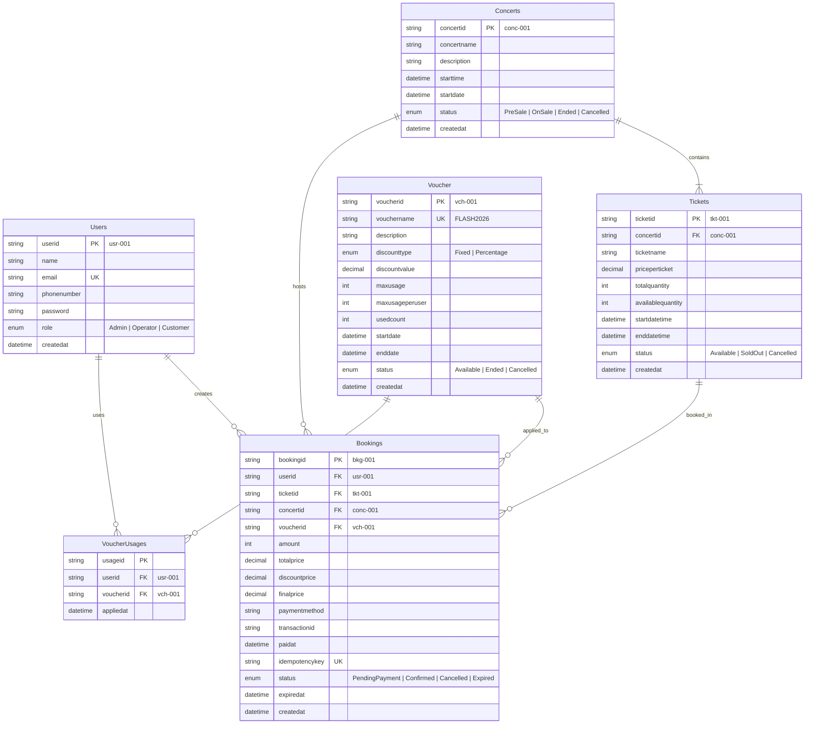
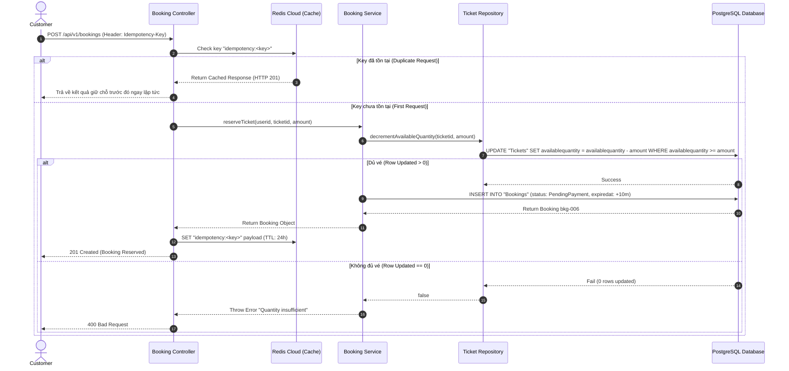

# 🏛️ System & Database Design Document (GEEK UP Ticket Booking Platform)

Tài liệu Thiết kế Kiến trúc Hệ thống, Mô hình Dữ liệu ERD, Luồng xử lý Sequence Diagram và Phân tích Kỹ thuật chuyên sâu cho bài toán Đặt vé Flash Sale chịu tải cao.

---

## 1. 🏗️ Mô Hình Kiến Trúc 3 Lớp (3-Layer Architecture)

Dự án tuân thủ nghiêm ngặt mô hình phân tầng **3-Layer Architecture** để tách biệt trách nhiệm (Separation of Concerns), giúp hệ thống dễ mở rộng và bảo trì:

```
                  ┌───────────────────────────────┐
                  │    HTTP Client / Postman      │
                  └──────────────┬────────────────┘
                                 │ HTTP Requests (JSON)
                                 ▼
   ┌─────────────────────────────────────────────────────────────┐
   │ 1. CONTROLLERS LAYER (src/controllers/)                     │
   │    - Tiếp nhận Express req / res.                            │
   │    - Thực hiện JWT Authentication & Role Authorization.     │
   │    - Chuyển tiếp Dữ liệu sang Services Layer.               │
   └─────────────────────────────┬───────────────────────────────┘
                                 │ Method Calls
                                 ▼
   ┌─────────────────────────────────────────────────────────────┐
   │ 2. SERVICES LAYER (src/services/)                           │
   │    - Chứa toàn bộ Business Logic & Rules.                   │
   │    - Ràng buộc Thời gian, Mức giảm giá, Hạn ngạch Voucher.  │
   │    - Tính toán Tổng tiền, Thành tiền finalprice.            │
   └─────────────────────────────┬───────────────────────────────┘
                                 │ Data Access Operations
                                 ▼
   ┌─────────────────────────────────────────────────────────────┐
   │ 3. REPOSITORIES LAYER (src/repositories/)                   │
   │    - Giao tiếp trực tiếp với PostgreSQL qua Prisma ORM.     │
   │    - Đảm bảo tính Toàn vẹn Giao dịch (Database Transaction).│
   │    - Thực thi Atomic SQL UPDATE để chống Overselling.       │
   └─────────────────────────────┬───────────────────────────────┘
                                 │ SQL Queries
                                 ▼
                    ┌──────────────────────────┐
                    │ PostgreSQL Database      │
                    └──────────────────────────┘
```

---

## 2. 🗄️ Mô Hình Cơ Sở Dữ Liệu (Entity Relationship Diagram - ERD)

Dưới đây là sơ đồ liên kết giữa 6 Thực thể trong PostgreSQL (Khớp 100% với `DATABASE.md` & `schema.prisma`):



---

## 3. 🔄 Luồng Đặt Vé Giữ Chỗ (Sequence Diagram - Flash Sale Booking Flow)

Sơ đồ trình bày luồng giữ chỗ vé, áp dụng Idempotency Redis Cloud và Atomic SQL Lock trong môi trường tải cao:



---

## 4. ⚡ Giải Pháp Kỹ Thuật Giải Quyết Bài Toán Tải Cao

### A. Chống Overselling (Bán vượt vé)
- **Vấn đề**: Trong đợt Flash Sale có 500 requests cùng tranh mua 10 vé còn lại tại cùng một thời điểm millisecond. Nếu dùng giải pháp đọc `select availablequantity` rồi mới `update` ở ứng dụng (Check-then-Act) sẽ bị hiện tượng **Race Condition** dẫn tới bán vượt kho.
- **Giải pháp lựa chọn**: **Atomic SQL UPDATE at Database Level**.
  ```sql
  UPDATE "Tickets"
  SET "availablequantity" = "availablequantity" - $1
  WHERE "ticketid" = $2 AND "availablequantity" >= $1;
  ```
  Nhờ cơ chế Row-level Lock tự nhiên của PostgreSQL, mỗi phép trừ kho là một thao tác Nguyên tử (Atomic operation). Nếu kho không đủ, câu lệnh trả về `0 rows updated` và hệ thống lập tức báo hết vé an toàn 100%.

### B. Chống Đặt Trùng Đơn (Idempotency Pattern)
- **Vấn đề**: Khách hàng ở mạng yếu bấm liên tục nút "Đặt Vé" khiến client gửi 5 requests trùng khớp cùng lúc.
- **Giải pháp lựa chọn**: **Redis Idempotency Middleware**.
  Header `Idempotency-Key` từ Client được lưu vào Redis Cloud với mốc TTL 24 giờ. Nếu phát hiện key trùng lặp, Middleware trả về ngay kết quả từ Cache mà không cho phép gọi lại Database lần thứ 2.
